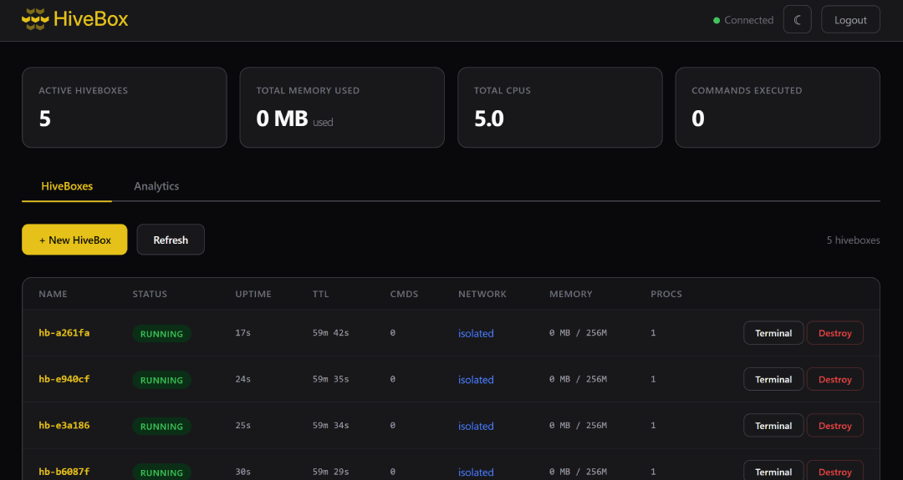

<p align="center">
  
</p>

<p align="center">
   <a href="https://teti.ai/hub">Build by TetiAI</a>
</p>

**Native Linux sandboxing built for the AI era.**

HiveBox turns Alpine Linux into a platform where sandboxing is a first-class primitive. No containers, no VMs — just direct kernel isolation (namespaces, cgroups, seccomp, Landlock) exposed through a simple CLI and REST API.

Each **hivebox** is a lightweight, isolated Linux sandbox. Launch thousands on a single host, each capable of running arbitrary commands in complete isolation with near-zero overhead.



## Stop sandboxing everything.

The AI industry has a proportionality problem. Every major platform spins up full Ubuntu containers — mounted filesystems, browsers, CLI tools, isolated networks — for every user interaction. A .pptx, a .docx, a .xlsx, a PDF, a CSV export. Tasks that take milliseconds with a lightweight library are burning entire virtual machines in the cloud.

To generate a 10-slide presentation, a small virtual computer boots. To format a Word document with headers, a container spins up. To create a spreadsheet with a few formulas, an isolated network is allocated. None of this requires a sandbox. It requires a function call.

The hidden cost is real:

- A single AI query consumes **10x more energy** than a traditional search
- Running workloads in Docker containers produces a [measurable increase in energy consumption](https://doi.org/10.1016/j.suscom.2023.100889) vs. bare Linux, due to I/O overhead
- U.S. AI data centers are projected to emit **24-44 million metric tons of CO2/year by 2030** and consume water equivalent to **6-10 million Americans** ([Cornell, 2025](https://doi.org/10.1038/s44221-025-00410-9))

But when you *do* need isolation — running untrusted code, AI agents executing arbitrary commands, multi-tenant environments — you need it done right, and you need it done light.

HiveBox is the proportionate answer: kernel-native isolation with near-zero overhead. No container runtime. No hypervisor. Just the Linux kernel doing what it already knows how to do.

| | Docker | gVisor | Firecracker | Daytona | **HiveBox** |
|---|---|---|---|---|---|
| Memory per sandbox | ~50 MB | ~30 MB | ~5 MB | ~50 MB+ (Docker-based) | **~2-5 MB** |
| Startup time | ~1 s | ~0.5 s | ~125 ms | ~90 ms (warm) | **~10-50 ms** |
| Isolation | Namespaces | Syscall emulation | Hypervisor | Docker (managed) | **NS + seccomp + Landlock** |
| Self-hosted | Yes | Yes | Yes | Yes (cloud also available, pay-per-second) | **Yes** |
| Complexity | High | Medium | Medium | High (requires Docker Compose) | **Low** |

Same security. A fraction of the resources. The smartest infrastructure is the one that uses the minimum needed for the task.

## Quick Start

### CLI

```bash
# Create a hivebox
hivebox create --name myagent --memory 512m

# Execute commands in it
hivebox exec myagent -- echo "hello from the hivebox"
hivebox exec myagent -- pip install requests numpy
hivebox exec myagent -- python3 scraper.py

# Check status
hivebox list

# Clean up
hivebox destroy myagent
```

### REST API

```bash
# Start the daemon
hivebox daemon --port 7070 --api-key mysecretkey

# Create a hivebox
curl -X POST http://localhost:7070/api/v1/hiveboxes \
  -H "Authorization: Bearer mysecretkey" \
  -H "Content-Type: application/json" \
  -d '{"name": "api-hivebox", "timeout": 3600}'

# Execute a command
curl -X POST http://localhost:7070/api/v1/hiveboxes/api-hivebox/exec \
  -H "Authorization: Bearer mysecretkey" \
  -H "Content-Type: application/json" \
  -d '{"command": "python3 -c \"print(1+1)\""}'

# Destroy
curl -X DELETE http://localhost:7070/api/v1/hiveboxes/api-hivebox \
  -H "Authorization: Bearer mysecretkey"
```

### MCP Bridge — Connect AI Agents to Sandboxes

HiveBox includes a built-in MCP (Model Context Protocol) server that bridges any AI coding agent into a sandbox. No custom agent loop — just plug your favorite MCP-compatible client (OpenCode, Claude Code, etc.) into any hivebox.

```
[AI Client] --HTTP--> [hivebox daemon :7070/mcp] --nsenter--> [Sandbox]
```

**Setup:**

1. Start the daemon and create a sandbox:
```bash
hivebox daemon --port 7070 --api-key mysecretkey
hivebox create --name myworkspace --memory 512m
```

2. Configure your AI client to connect via MCP over HTTP (no local binary needed):
```json
{
  "mcpServers": {
    "sandbox": {
      "url": "http://your-server:7070/api/v1/hiveboxes/{HIVEBOX_ID}/mcp",
      "headers": { "Authorization": "Bearer mysecretkey" }
    }
  }
}
```

3. The AI client now has 15 tools to operate inside the sandbox: `exec`, `read_file`, `read_multiple_files`, `write_file`, `edit_file`, `list_directory`, `directory_tree`, `search_files`, `get_file_info`, `create_directory`, `move_file`, `upload_file`, `download_file`, `read_media_file`, `list_directory_with_sizes`.

### Web Dashboard

HiveBox includes a built-in web dashboard for managing hiveboxes from the browser.
Start the daemon and navigate to:

```
http://localhost:7070/dashboard
```

The dashboard provides:
- Login with API key
- Create, list, and destroy hiveboxes
- Built-in terminal to execute commands in any hivebox
- Real-time hivebox status (uptime, TTL, resource usage, command count)
- Auto-refresh every 10 seconds

No external dependencies — everything is embedded in the binary.

## Architecture

HiveBox uses three components:

1. **Alpine Linux host** — unmodified vanilla Alpine (or any Linux with kernel 5.15+)
2. **`hivebox` binary** — single static Rust binary (~5 MB) managing hivebox lifecycle
3. **Rootfs image** — single Alpine base squashfs image mounted with overlayfs

### Six Layers of Isolation

Every hivebox is protected by six independent security layers:

```
+---------------------------------------------------+
|                  User Command                      |
+---------------------------------------------------+
|  6. seccomp-BPF     — syscall allow-list           |
|  5. Capabilities    — minimal privilege set         |
|  4. Landlock LSM    — filesystem path control       |
|  3. pivot_root      — filesystem isolation          |
|  2. cgroup v2       — resource limits               |
|  1. Namespaces      — process/net/mount/user        |
+---------------------------------------------------+
|                  Linux Kernel                       |
+---------------------------------------------------+
```

1. **Namespaces** (PID, Mount, Network, User, UTS, IPC) — complete process isolation
2. **cgroup v2** — memory, CPU, PID limits; swap disabled
3. **pivot_root** — host filesystem becomes unreachable
4. **Landlock LSM** — path-based filesystem access control
5. **Capability dropping** — minimal privilege set + `NO_NEW_PRIVS`
6. **seccomp-BPF** — syscall allow-list (~80 default, ~40 strict)

### Filesystem

Each hivebox uses overlayfs over squashfs base images:

```
merged/ (rw)      <- hivebox sees this
  +-- upper/ (tmpfs)    <- writes go here (vanishes on destroy)
  +-- squashfs/ (ro)    <- shared Alpine base across all hiveboxes
```

### Networking

Three modes: `none` (default, no network), `isolated` (NAT to internet), `shared` (bridge between hiveboxes).

## Building

Requires Rust toolchain. Target platform: Linux with kernel 5.15+.

```bash
# Development build
cargo build

# Static release build (for Alpine deployment)
cargo build --release --target x86_64-unknown-linux-musl

# The binary is fully static — copy it anywhere
cp target/x86_64-unknown-linux-musl/release/hivebox /usr/bin/
```

### Docker

```bash
# Build the image
docker build -t hivebox .

# Run with privileged mode and host cgroup namespace
docker run --privileged --cgroupns=host -p 7070:7070 \
  -e HIVEBOX_API_KEY=your-secret-key \
  hivebox
```

**Environment variables:**

| Variable | Description | Required |
|----------|-------------|----------|
| `HIVEBOX_API_KEY` | API key for authentication (`Authorization: Bearer <key>`) | No (but recommended) |

> **Note**: `--privileged` is required for Linux namespaces, cgroups, and mount operations.
> `--cgroupns=host` gives access to the host cgroup hierarchy, needed for memory/CPU/PID limits on hiveboxes. Without it, hiveboxes still work but without resource limits.

## Deployment

### Build rootfs image

```bash
sudo bash scripts/build-images.sh
```

This builds the Alpine base squashfs image. To pre-install packages in all hiveboxes, add them to the Dockerfile or the base image build script. For per-hivebox packages, use `hivebox exec <name> -- apk add <package>`.

### Start the daemon

```bash
# Direct
hivebox daemon --port 7070 --api-key your-secret-key

# OpenRC (Alpine)
sudo cp config/hivebox.openrc /etc/init.d/hivebox
sudo rc-update add hivebox default
sudo rc-service hivebox start
```

See [docs/deployment.md](docs/deployment.md) for full production setup.

## API Endpoints

| Method | Path | Description |
|--------|------|-------------|
| `GET` | `/healthz` | Health check (no auth) |
| `POST` | `/api/v1/hiveboxes` | Create hivebox |
| `GET` | `/api/v1/hiveboxes` | List hiveboxes |
| `GET` | `/api/v1/hiveboxes/:id` | Get hivebox details |
| `POST` | `/api/v1/hiveboxes/:id/exec` | Execute command |
| `POST` | `/api/v1/hiveboxes/:id/mcp` | MCP over HTTP |
| `PUT` | `/api/v1/hiveboxes/:id/files` | Upload file |
| `GET` | `/api/v1/hiveboxes/:id/files` | Download file |
| `DELETE` | `/api/v1/hiveboxes/:id` | Destroy hivebox |
| `GET` | `/api/v1/analytics` | Metrics history |

See [docs/api.md](docs/api.md) for full API reference.

## Documentation

- [Architecture](docs/architecture.md) — design, filesystem layout, networking
- [API Reference](docs/api.md) — REST API endpoints and examples
- [CLI Reference](docs/cli.md) — all commands and flags
- [Deployment Guide](docs/deployment.md) — production setup, OpenRC, systemd
- [Security Model](docs/security.md) — threat model, security layers, limitations

## Disclaimer

HiveBox is **experimental software** under active development. It is **not production-ready** and should not be used in critical or production environments. The authors assume no responsibility for any damage, data loss, or security issues that may arise from its use. Use at your own risk.

## License

BSD 3 — see [LICENSE](LICENSE).
